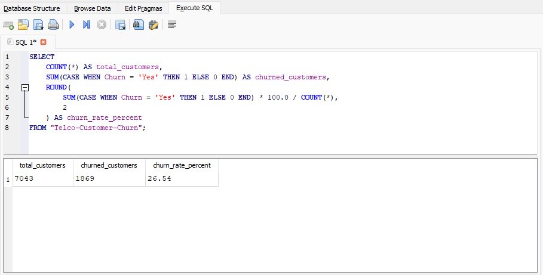
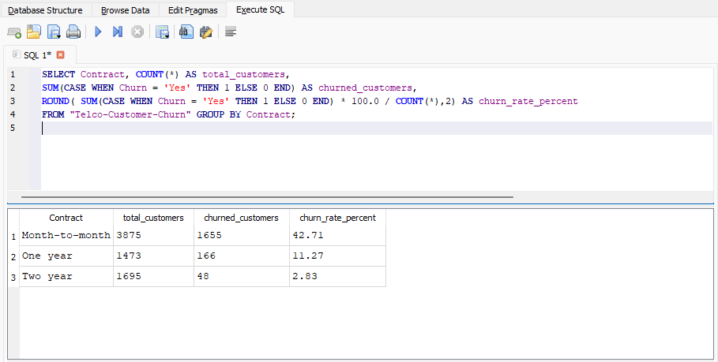
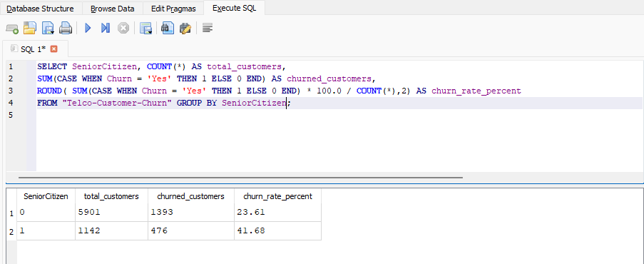
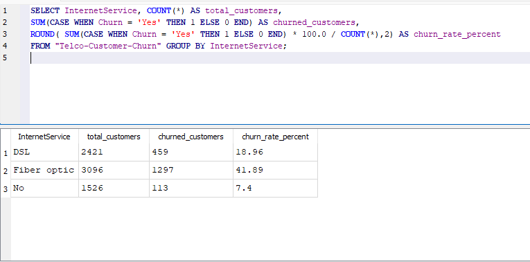
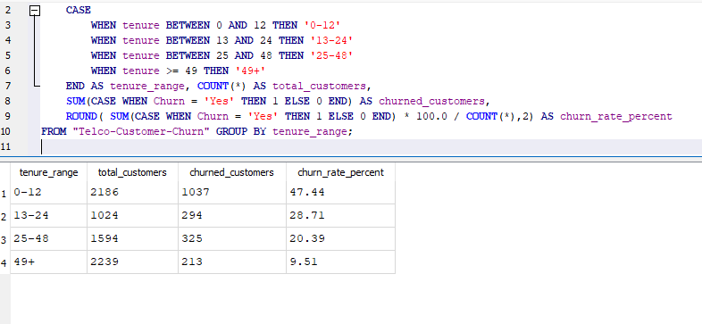

**#Below is the screenshot of churn rate sql query and its result:**

Results:-26.53% of customers churned in this dataset

Explanation:

Total Customers: Total number of customers in the dataset

Churned Customers: Number of customers who left

Churn Rate: Percentage of customers who churned

#Below is the screenshot of churn by contract sql query and its result:

Result:- Months to months contracts have higher churn rate

2 years contract have lowest churn rate

#Below is the screenshot of churn by senior citizen sql query and its result:

Explanation:- 1 in SeniorCitizen Column means senior citizen

0 in SeniorCitizen Column means not a senior citizen

Results:- senior citizens have higher churn rate which is 41.68%

#Below is the screenshot of churn by service sql query and its result:

Result:- Customers with FiberOptice internet service has higher churn rate which is 41.89% follwed by DSL internet service i.e. 18.96%.

Customers with no internet servive has lowest churn rate which is 7.4%

#Below is the screenshot of churn by tenure range sql query and its result:

Result:- Customers churn rate decreses with increasing tenure range as shown with 47.44% churn rate for 0-12 tenure range to 9.51% churn rate for 49+ tenure range respectively. 

